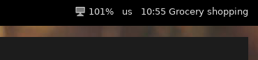

# What is this?
It's a script that communicates with Google's calendar API, it will go through all your calendars and print the next calendar event details  
You can take this input and show it on your i3-bar or polybar  

## How does it to that
It will read your next 10 events from each of your calendars, then go through them all and figure out which one is closest  
It will print the time and title of the closest event  

## Where's the code
It's here [i3_agenda/__init__.py](i3_agenda/__init__.py)

# Setup

## Dependencies
You need to install some python libraries  
Make sure python3 is your default python  
Run `sudo pip3 install python-bidi google-api-python-client google-auth-httplib2 google-auth-oauthlib`  

## Google API
https://developers.google.com/calendar/quickstart/python

1. You need to create a Google API project and download your OAuth 2.0 credentials json file   
You first need to create a project [here](https://console.developers.google.com/apis/credentials), then add Google Calendar support, then download the credentials.json file.  
**Alternatively, you can just use [this link](https://developers.google.com/calendar/quickstart/python) and click "Enable the Google Calendar API". This will create a project, add Google Calendar support, and let you download the file in 1 click**  
If you're having trouble, you can use this tutorial for more information [https://developers.google.com/calendar/auth](https://developers.google.com/calendar/auth)  
Another great guide can be found here if you're still having trouble: [https://github.com/jay0lee/GAM/wiki/CreatingClientSecretsFile](https://github.com/jay0lee/GAM/wiki/CreatingClientSecretsFile)
2. Download the credentials file to somewhere on your computer  
3. Proceed to installation phase

## Installation
After installing the dependencies, and downloading the credentials file,  
1. Clone the repo to a local directory `cd ~/ && git clone https://github.com/rosenpin/i3-agenda && cd i3-agenda`
3. Run the script `python3 i3_agenda/__init__.py -c $CREDENTIALS_FILE_PATH` with "$CREDENTIALS_FILE_PATH" replaced with the path to the credentials.json file you downloaded in the previous step. If configured correctly, it will prompt you to log in in your browser, accept everything. It should print your next event.   
4. Optional: you can run `sudo python setup.py install` to add the script to your path so you can run `i3-agenda` anywhere
5. Add configuration to your bar (examples in the Examples section below)

### Arch Linux
1. `yay -S i3-agenda-git`
2. Add configuration to your bar (examples in the Examples section below)

# Usage
## Filter displayed calendars

To display events only from certain calendars the variable `allowed_calendars_ids` at the beginning of the script can be populated inserting the list of ids (as string) of the calendars you are interested in.

To obtain the calendar id you can check the settings page of the calendar on Google (usually is the owner email, if it's not shared).

Leaving the list empty will fetch all calendars (default behavior).

## Notes
It might not work properly if you have more than 10 all day events, this can be fixed by increasing the maxResults variable    

It uses a caching mechanism so you won't have to contact Google servers every minute, to set the cache TTL use the -ttl flag when running  
`i3-agenda --ttl 60` to set the TTL to 60 (meaning it will contact Google again every hour)
This means that if you create a new event, it might take an hour for the script to recognize it  
The default is 30 minutes

## Examples
Example polybar configuration  
```
modules-center = agenda
....
[module/agenda]
type = custom/script
exec = i3-agenda -c ~/.google_credentials.json -ttl 60
click-left = chromium https://calendar.google.com/calendar/r/day
interval = 60
```  

Example i3block configuration
```
[i3-agenda]
command=i3-agenda -c ~/.google_credentials.json -ttl 60
interval=60
```  


Example output of the script:  
```11:00 Grocery shopping```



